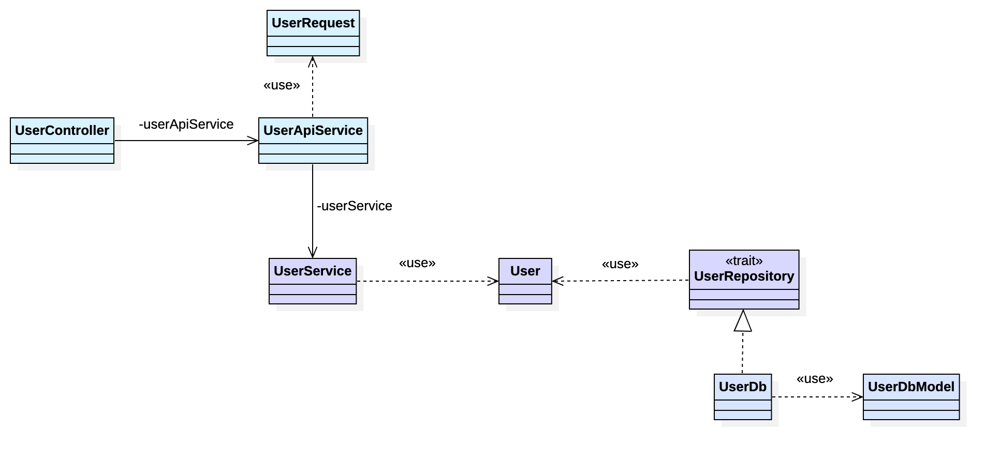

# Hexagonal Architecture Demo

This is a Scala / Play Framework demo implementation of the Hexagonal Architecture.



Run the application:

```sh
sbt
compile
project api
run
```

Create a user:

```sh
curl -X POST \
  http://localhost:9000/users \
  -H 'Accept: application/json' \
  -H 'Content-Type: application/json' \
  -d '{
        "name": "Joe",
        "username": "joe@example.com",
        "password": "abc"
      }'
```

Read a user:

```sh
curl http://localhost:9000/users/<id>
```

Update a user:

```sh
curl -X PUT \
  http://localhost:9000/users/<id> \
  -H 'Accept: application/json' \
  -H 'Content-Type: application/json' \
  -d '{
        "name": "Joe 2",
        "username": "joe2@example.com",
        "password": "abcd"
      }'
```

Delete a user:

```sh
curl -X DELETE http://localhost:9000/users/<id>
```

## References

* Kuc, Karol. Hexagonal Architecture by example - a hands-on introduction. https://blog.allegro.tech/2020/05/hexagonal-architecture-by-example.html
